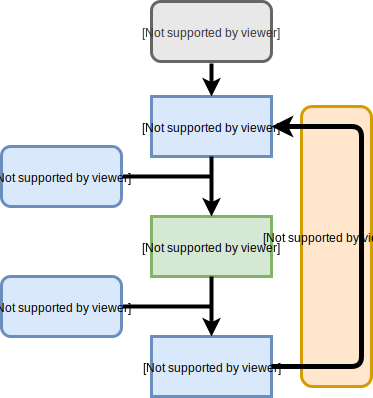

.. _concepts:

Conceptual basis
================

EasyVVUQ was created as part of the `VECMA <http://www.vecma.eu/>`_ project.
The aim of this project was to make state of the art VVUQ algorithms
available for use in HPC applications (and specifically multiscale models).
The basis of making generic tools within VECMA is the idea of *Patterns*,
which are:

    “abstractions that describe, in a non-application and non-domain
    specific manner, a workflow or algorithm for conducting validation,
    verification, uncertainty quantification or sensitivity analysis”.

Making use of Patterns in practice requires that they are decomposed into
components which can be flexibly combined to implement a range of algorithms.

   Figure 1: Decomposition of generalized VVUQ workflow into different
   functions.
   These are implemented as 'Elements' in EasyVVUQ.
   Rounded boxes are specified by users to tailor general workflows to their
   particular use case

EasyVVUQ is designed around a breakdown of such workflows into four distinct
stages (see Figure 1); *Sampling*, *Model Evaluation*, result *Aggregation*,
and *Analysis*.
In an HPC context the model evaluation step is generally equivalent to the
execution of a (computationally expensive) simulation.
The actual simulation execution is beyond the remit of the package but
EasyVVUQ is designed to wrap around simulation execution, providing functions
to generate input (an ``Encoder``) and to transform simulation output into common
formats for analysis (a ``Decoder``).
Below we describe the components of EasyVVUQ designed to perform each step in
more detail.

Parameter description
---------------------

The first step in our generalised workflow is a description of the model
parameters and how they might vary in the sampling phase of the VVUQ pattern.
Typically the user will specifying all numerical parameters, the distribution 
from which they should be drawn and physically acceptable limits on their 
value.

Campaign
--------

EasyVVUQ workflows are coordinated by an object called a ``Campaign``.
This contains a common database, the ``CampaignDB``, which contains information
on the application(s) being analysed alongside the runs mandated by the sampling
algorithm(s) employed.
The `Campaign` handles all validation and is transfers information between
each stage of the workflow.

Elements
--------

Within VECMA software components that can be reused in a wide range of
application scenarios are known as ``Elements``.
Within EasyVVUQ we provide five classes of ``Elements`` (:ref:`samplers`,
:ref:`decoders`, :ref:`encoders`, and those providing :ref:`collation`,
for the aggregation step, and :ref:`analysis` functionality) which we 
describe below.

.. _samplers:

Samplers
--------

A ``Sampler`` populates the `CampaignDB` with a set of run specifications based on
the parameter description provided by the user.
Each ``Sampler`` is designed to employs one of a range of algorithms, such as
the Monte Carlo or Quasi Monte Carlo approaches (Sobol, 1998).
They deal with generic information in the sense that all parameters use the
nomenclature and units provided by the user rather than anything specific to
any application or workflow.

.. _encoders:

Encoders
--------

The role of an ``Encoder`` is to convert generic parameter descriptions into
inputs (for example configuration files) which can be used in a specific
application.
Included in the base application is a simple templating system in which
values are substituted into a text input file. 
For many applications it is envisioned that specific encoders will be
needed and the framework of EasyVVUQ means that any class derived from a
generic Encoder base class is picked up and may be used.
This enables EasyVVUQ to be easily extended for new applications by 
experienced users.

.. _decoders:

Decoders
--------

The role of a ``Decoder`` is twofold, to record simulation completion in the
``CampaignDB`` and to extract the output information from the simulation runs.
Similarly to an ``Encoder``, a ``Decoder`` is designed to be user extendable to 
facilitate analysis of a wide range of applications. 

.. _collation:

Collation
---------

``Collation`` elements gather ``Decoder`` output across multiple runs to provide a
combined and generic expression of the simulation results for further analysis
(for example the default is to bring together output from all simulation runs
in a Pandas dataframe).

.. _analysis:

Analysis
--------

The final goal of any VVUQ workflow is an analysis which provided information
on the simulation output across a range of runs.
Different types of analysis (for example bootstrapping of multiple runs from
varied initial conditions) are, or will be,  provided by EasyVVUQ.

