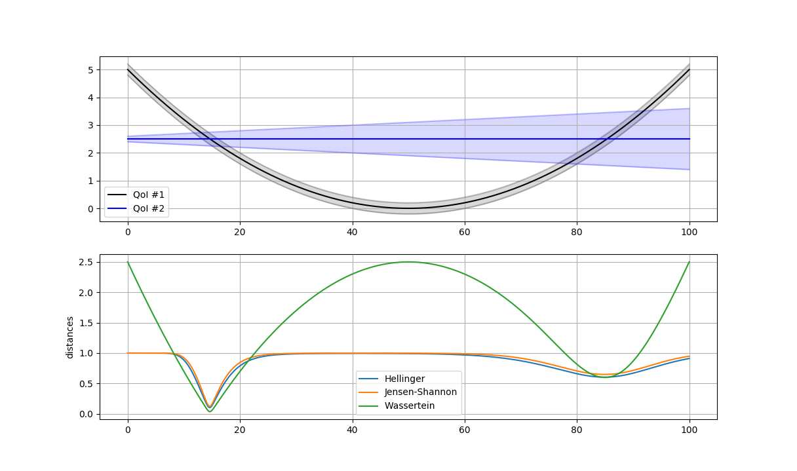

.. _validate_similarities_tutorial:

Validation by comparing QoI distributions
=========================================

This tutorial shows how to use a Validation Similarities pattern in EasyVVUQ.

We test here two quantities of interest (QoI) represented by two analytical functions with Gaussian uncertainties.

The first function is a parabolic function::
  
    mu1 = (y - 50.)**2 / 500.
    sig1 = 0.2
    dist1 = chaospy.Normal(mu1, sig1)

The second function a constant but with changing uncertainty on one side::
  
    mu2 = 2.5
    sig2 = 0.1 + 0.01 * y
    dist2 = chaospy.Normal(mu2, sig2)
    
In the upper pannel of the figure given below, you see how these functions look when we are varing :code:`y` in the intervalle :code:`[0, 100]`.

Validations metrics
-------------------

In EasyVVUQ, we implemented the calculation of three different metrics:
Hellinger, Jensen-Shannon and Wasserstein (cf. references below for more details). This allows us to compute distances between two QoI distributions.

QoI distributions
-----------------

We can use Chaospy to compute the probability densities and the cummulative distributions functions needed for the above-mentioned  metrics::

    # Probabily densities: for Hellinger and Jensen-Shannon
    p1 = dist1.pdf(x)
    p2 = dist2.pdf(x)

    # Cummulative distributions (with weight): for Wasserstein
    dx = x[-1] - x[0]
    c1 = dx * dist1.cdf(x)
    c2 = dx * dist2.cdf(x)
    
The sampling values :code:`x` can be computed using the min/max values of a common large support of QoI distrubtions, for example::

    x = np.linspace(min_value, max_value, 1000, endpoint=True)
    
**Note 1**: The min/max values can be obtained from lower and upper bound of the distributions. In case of univarainte distribution, we can use: :code:`dist.lower[0]` and :code:`dist.upper[0]`.

**Note 2: Distribution based on samples**

To build QoI distribution from list of samples that resutls fron UQ simulations, observations or measurements, we can use::

  dist = chaospy.SampleDist(samples)

It estimates a distribution from the given samples by constructing a kernel  density estimator (KDE).

Validate similarities
----------------------

Once probabily densities functions (or Cummulative distributions) are comupted for each QoI, we create a :code:`validater`, object of EasyVVUQ, and get the distance using :code:`compare` routine. We can use for example Hellinger metric by comparing two lists of probabily densities, :code:`pdf1` and :code:`pdf2`::

    # Validater based on Hellinger metric
    validater = easyvvuq.comparison.ValidateSimilarityHellinger()
    distance = validater.compare(pdf1, pdf2)

The complete code for this example, using other metrics, can be found `here <https://github.com/UCL-CCS/EasyVVUQ/blob/dev/docs/tutorial_files/validate_similarities.py>`_.

Finally, in the lower panel of the the different distances between QoI 1 and Qo 2 are displayed:

The first two are yielding answers between 0 (zero distance: identical distributions) and 1 (very different), Wasserstein instead are unrestricted with a lower limit of zero.

References
----------

`Hellinger distance <https://en.wikipedia.org/wiki/Hellinger_distance>`_

`Jensen-Shannon divergence <https://en.wikipedia.org/wiki/Jensen%E2%80%93Shannon_divergence>`_

`Wasserstein metric <https://en.wikipedia.org/wiki/Wasserstein_metric>`_
