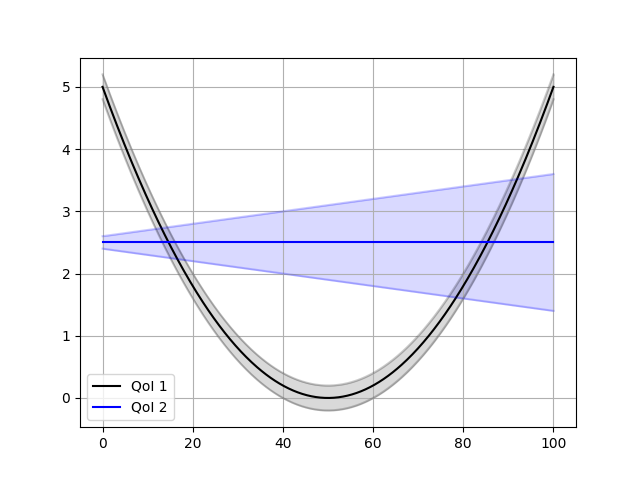

.. _validate_similarities_tutorial:

Validation by comparing QoI distributions
=========================================

This tutorial shows how to use a Validation Similarities pattern in EasyVVUQ. 

We test here two quantities of interest (QoI) represented by two analytical functions with Gaussian uncertainties.

The first function is a parabolic function::
  
    mu1 = (y - 50.)**2 / 500.
    sig1 = 0.2
    dist1 = chaospy.Normal(mu1, sig1)

The second function a constant but with changing uncertainty on one side::
  
    mu2 = 2.5
    sig2 = 0.1 + 0.01 * y
    dist2 = chaospy.Normal(mu2, sig2)
    
Here you how these functions look, when we are varing y in the intervalle [0, 100]:

Validations metrics
-------------------

The complete code for this example can be found `here <https://github.com/UCL-CCS/EasyVVUQ/blob/dev/docs/tutorial_files/validate_similarities.py>`_.
